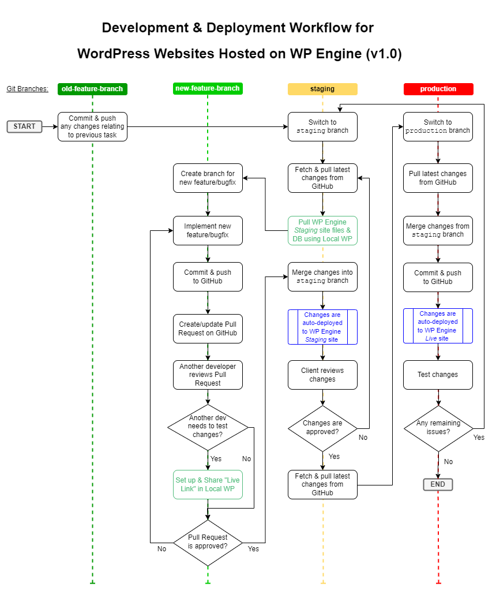
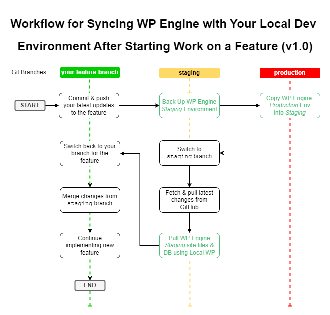

# [SITE-NAME-HERE] WordPress Website

This repo contains the custom code for the [SITE-NAME-HERE] website, which is built on
WordPress and hosted on [WP Engine](https://wpengine.com/). It was taken on by 
Generate UK in [MONTH] [YEAR]. The live website can be accessed from [LIVE-SITE-URL-HERE]
and the staging website can be accessed from [STAGING-SITE-URL-HERE].

To start working with the files in this repo, follow the instructions in the
[Getting Started](#getting-started) section below.

**Please note that this website is set up to use Generate UK's special 
[development & deployment workflow](#development--deployment-workflow) for WordPress 
sites hosted on WP Engine. It is very important to follow this workflow when implementing 
and deploying changes - failure to do this may result in major website issues!** 

**Most notably, code changes should _not_ be uploaded into the `staging` or 
`production` WP Engine environments using SFTP or any other similar method - instead use 
the approach described in this document. It is also generally _not_ recommended to 
directly replicate the databases from any `local`, `development` and/or `staging`
environment(s) into the `production` environment on WP Engine.**

## Contents

1. [Getting Started](#getting-started)
2. [Files in this Repository](#files-in-this-repository)
3. [Development & Deployment Workflow](#development--deployment-workflow)
4. [Implementing Smaller Site Changes](#implementing-smaller-site-changes)
5. [Making Website Content Changes](#making-website-content-changes)
6. [Git Usage Guidelines](#git-usage-guidelines)
7. [Generate UK Coding Principles](#generate-uk-coding-principles)
8. [Website Testing & QA](#website-testing--qa)
9. [Security](#security)
10. [UNIX Line Endings on Windows](#unix-line-endings-on-windows)
11. [Further Resources](#further-resources)

## Getting Started

To start working on this website, please follow the steps below.

1. Install & configure the _[Local WP](https://localwp.com/)_ software on your computer if 
   it is not installed already. 
2. Ensure that _Local_ can connect to WP Engine if you have not done so already, by 
   following the instructions here: 
   https://localwp.com/help-docs/local-features/local-connect/#connect-to-wp-engine
3. Pull the current `staging` environment from WP Engine to your PC, using the
   _Local_ software.
4. Check that the _Local_ website loads successfully when you visit it.
5. Find out the location of the _Local_ website files, by clicking on the 
   _'Go to site folder'_ link at the top within _Local_, then navigating to the 
   `app/public/` sub-folder.
6. Clone the files from the website's repo on GitHub into a _temporary_ new folder.
7. Move/copy all the files from the temporary new folder into the folder where the 
   _Local_ website files are located (see step 5), overwriting the existing versions 
   of all files where applicable. _Note: if you are using a Mac, you may need to 
   [use the `ditto` command](https://osxdaily.com/2010/08/12/merge-directories-in-mac-os-x/) 
   to merge the contents of these 2 folders together._
8. You can now start working on the site. Follow the [Development & Deployment
   workflow](#development--deployment-workflow) below.

_See also: [Flowchart of the general steps to follow when you start working on *any* 
website that is hosted on WP Engine](https://wiki.guk.agency/manual/development-processes/article/wp-engine-development-deployment-workflow#_Tocj4l0f4vt7ff7)_

## Files in this Repository

**This repo should only contain _custom_ website code that is directly managed by Generate
UK - for example, bespoke plugins, custom themes, etc.** All 3rd party code (for example
the core WP installation, any installed 3rd party plugins & themes, etc) are intentionally
excluded from this repo via the [.gitignore](.gitignore) file - these files should
instead be managed by WP Engine, and/or via the WP admin area.

You will need to manually update the `.gitignore` file if you start building any new
custom plugin or theme (or similar) - this will ensure the relevant custom files
don't get excluded from the repo. To do this, add a new line to the appropriate section of
the `.gitignore` file, similar to the one below:

```
!/wp-content/plugins/MY_PLUGIN
```

Note the exclamation mark (`!`) at the beginning of the line, followed by the filepath 
of the folder you don't want to exclude. After you add this line and save the file, you
can then add any files within the specified folder to the repo.

In rare cases, if it is necessary to modify or fork 3rd party code (e.g. by _directly_ 
tweaking the code of a 3rd party theme or plugin), the relevant plugin(s) and/or theme(s) 
should _also_ be added to this repo via the steps above, and then manually managed by 
Generate UK moving forward. Where possible though, any direct modifications to 3rd party 
code should be avoided and kept to a minimum.

## Development & Deployment Workflow

Below is a flowchart that shows the steps to follow when adding new features, making 
custom theme changes, implementing bugfixes, or making other similar changes upon this 
website. **It is important to follow this process to avoid major site issues.**



Please see 
https://wiki.guk.agency/manual/development-processes/article/wp-engine-development-deployment-workflow
for further information about this workflow, including a summary of its main features and
the associated benefits - as well as more detailed instructions, based on the above 
flowchart.

This deployment process is based roughly on the approach described at:

https://wpengine.com/builders/branched-deploys-wp-engine-github-actions/

It aims to follow WP Engine's recommended Best Practices for Development Workflows - see:

https://wpengine.com/support/development-workflow-best-practices/

Sometimes after you have _already_ started work on a new site feature, you may want to
ensure your local development environment is in sync with the latest content & deployed
code changes upon the WP Engine site environments. The flowchart below shows a safe way
to achieve this, whilst preserving any recent code changes that you have made:



After you have completed the steps in this flowchart, you can proceed with the standard
steps in the _Development & Deployment_ flowchart above, from the _"Implement new
feature/bugfix"_ step onwards.

## Implementing Smaller Site Changes

If you are just making minor _content_ changes to the website, or your changes don't 
involve making any adjustments to any of the custom code on the site (for example if you 
are just installing or updating _3rd party_ WP plugin(s)), or you are only implementing 
incredibly minor custom code tweaks, you may be able to skip some of the above workflow 
steps. You should evaluate this on a case-by-case basis, depending on the nature of the 
changes, and the level of risk.

**However, in every scenario:**

 * **All custom website code changes _always_ need to be committed & pushed to GitHub 
   (and thus auto-deployed using the mechanism described above), to ensure they don't get 
   lost or overwritten.**
 * **It is still also strongly recommended to test your changes in at least the WP Engine 
   staging environment before making them on the live site, as well as obtaining feedback 
   from the client and/or another developer where appropriate.**

If you need to skip an auto-deployment to WP Engine when committing & pushing changes to 
the `production` or `staging` branches for any reason, you can do this by including the
phrase `[ci skip]` within the commit message.

These guidelines may evolve in the future.

## Making Website Content Changes

Please note that the Live website may frequently be updated by the client or by other
developers.

Before starting any significant work on the site, it is therefore recommended to replicate
the latest version of the _Production_ environment across to the _Staging_ environment on
WP Engine (_make sure you first make a backup of the Staging environment in WP Engine
if you do this!_), and then to pull this environment into your _Local_ copy of the site,
to ensure that each environment contains the latest available site content. This helps to 
avoid unpleasant surprises later, such as unexpected bugs or conflicts due to any
differences between the sites.

**IMPORTANT NOTE: It is generally _not_ safe to replicate the _Local_, _Development_ or 
_Staging_ environment(s) or database(s) into the _Production_ environment on WP Engine -
see:**

https://wpengine.com/support/development-workflow-best-practices#Database_Moves_Down_Code_Moves_Up

Therefore, it is usually necessary for developers to use alternative strategies to make 
content changes upon the website safely. The best approach may vary depending on the type
of changes that need to be made - however some potential suggestions can be found here:

https://wiki.guk.agency/manual/development-processes/article/wp-engine-development-deployment-workflow#_Tocl7vpl4g3dvn2

If you decide to implement the content changes programmatically via database content 
update/migration script(s), this website includes a custom WP plugin that provides a 
mechanism to do this relatively easily, using standard WordPress PHP functions. For 
details of how to work with this plugin, please see the 
[Site Data Updates Plugin README File](wp-content/plugins/site-data-updates/README.md).

## Git Usage Guidelines

When working on this site, you should aim to follow Generate UK's general Git Usage
Guidelines - see:

https://wiki.guk.agency/manual/development-processes/article/using-git-at-generate-uk#_Tocbmakvjezdzwv

## Generate UK Coding Principles

1. Use meaningful file, class, function & variable names.
2. Aim to minimise unnecessary nested levels of indentation per function, to ensure code 
   is as easy to read and understand as possible. Indent code correctly.
3. Aim to keep functions short to ensure that the logic is easy to follow and is more 
   testable; split into smaller functions if needed.
4. Minimise code duplication.
5. Call existing platform functions instead of writing new code where possible; follow 
   existing conventions used by the platform.
6. Ensure code is as self-contained and modular as possible. Use dependency injection,
   OOP etc if applicable.
7. Handle likely errors gracefully to reduce the risk of crashes.
8. Follow platform security recommendations. Assume any input could be malicious.
9. Comment code extensively, particularly in blocks above each function, and if the code 
   purpose may be unclear.
10. Follow the “[boy scout rule](https://deviq.com/principles/boy-scout-rule)”, leaving
   code cleaner than we found it.

## Website Testing & QA

For more info on the recommended approach to take during website testing & QA, as well as
details of some useful tools that can be used to facilitate this testing, see:

https://wiki.guk.agency/manual/development-processes/article/testing-qa

## Security

All custom & 3rd-party code must be written with security in mind, and various additional
precautions need to be taken, in order to reduce the risk of this website being 
compromised by attackers. Please therefore follow these guidelines:

1. [Never trust user input](https://wiki.guk.agency/manual/development-processes/article/security#_Toc1k3973f4efyv) 
   (e.g. `POST` or `GET` parameters, session & cookie data, DB content etc) - instead 
   validate, escape, filter and/or sanitise this data prior to storage or display.
2. [Utilise built-in platform capabilities & conventions](https://wiki.guk.agency/manual/development-processes/article/security#_Tocfdf9b93k0832),
   e.g. by calling built-in WP functions, utilising WP Roles & Capabilities, etc.
3. Follow the official WordPress security recommendations here:
   https://developer.wordpress.org/apis/security/
4. [Ensure your computer is set up securely](https://wiki.guk.agency/manual/development-processes/article/security#_Tocrgq902jel41p)
   and is kept up-to-date.
5. Implement countermeasures against various
   [common website security vulnerabilities](https://wiki.guk.agency/manual/development-processes/article/security#_Toccmluhjboew5u).
6. [Be careful when working with 3rd-party plugins, themes & other code](https://wiki.guk.agency/manual/development-processes/article/security#_Tocxnx5baiaw2lw) -
   e.g. only use well-maintained code from reputable vendors; install released updates 
   promptly; etc.
7. [When writing custom code](https://wiki.guk.agency/manual/development-processes/article/security#_Toc27de3qrd0zgk): 
   minimise code duplication; remove old code that is no longer in use; use 
   _"allowlisting"_ rather than _"denylisting"_ where possible; etc.
8. Utilise the [security measures](https://wiki.guk.agency/manual/development-processes/article/security#_Tocoe2ge09gt6d5)
   built into the WP Engine hosting platform - such as the WAF, automatic patching of 
   system components, etc.
9. Only provide people with the minimum necessary level of access that they need; set
   up separate account(s) for each individual user who needs access.
10. Ensure that you [use & manage site passwords & keys securely](https://wiki.guk.agency/manual/development-processes/article/security#_Tocumfqihblnujw).
11. Take additional precautions if the website [handles payments](https://wiki.guk.agency/manual/development-processes/article/security#_Tocyrpie7z5v0d3).
12. Aim for _["Defence in Depth"](https://wiki.guk.agency/manual/development-processes/article/security#_Tochj9kvo8cyqt0)_ -
    do not rely purely on _"Security through Obscurity"_.

For more comprehensive information about the above website security guidelines, see:

https://wiki.guk.agency/manual/development-processes/article/security

## UNIX Line Endings on Windows

Note that on Windows machines, some issues may occasionally arise if certain files aren't 
using UNIX-style line endings; this can occur where Git automatically converts files to 
use Windows-style line endings by default. We have attempted to prevent this occurring for 
this project, by adding a .gitattributes file, which forces UNIX-style line endings for 
all non-binary files.

In addition, it is strongly recommended to set up any IDEs, text editors etc to
use UNIX-style line endings where applicable. See [instructions on how to do this
within PhpStorm](https://www.jetbrains.com/help/phpstorm/configuring-line-endings-and-line-separators.html).

See also https://help.github.com/articles/dealing-with-line-endings/ for more info,
as well as for details of additional potential solutions.

## Further Resources

 * [Zoho Learn - Development & Deployment Workflow - Further Details](https://wiki.guk.agency/manual/development-processes/article/wp-engine-development-deployment-workflow)
 * [Zoho Learn - Slides from the December 2023 Training Workshop](https://wiki.guk.agency/manual/development-processes/article/wp-engine-dev-deploy-workflow-slides-dec-2023)
 * [WP Engine - Branched Deploys with GitHub Actions](https://wpengine.com/builders/branched-deploys-wp-engine-github-actions/)
 * [WP Engine - Development Workflow Best Practices](https://wpengine.com/support/development-workflow-best-practices/)